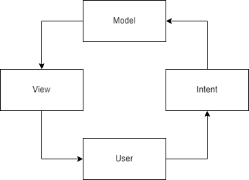

# MVI

MVI는 단방향 데이터 흐름과 단일 상태(Single Source of Truth)를 기반으로 UI를 예측 가능하게 관리하는 아키텍처이다.

핵심은 상태를 어떻게 저장하느냐보다 **상태가 어떻게 변경되는지를 명확하게 정의하는 것**에 있다.

---

## 구성 요소

### Model (State)

Model은 화면의 상태를 의미하며, 하나의 단일 상태 객체로 표현된다.

```kotlin
data class UiState(
    val count: Int = 0,
    val isLoading: Boolean = false,
)
```

- UI를 그리는 데 필요한 모든 데이터 포함
- 항상 최신 상태를 단 하나만 유지 (Single Source of Truth)

### Intent

Intent는 사용자의 의도를 나타낸다. 즉, UI에서 발생하는 액션을 의미한다.

```kotlin
sealed interface UiIntent {
    data object ClickIncrement : UiIntent
    data object ClickDecrement : UiIntent
}
```

- 버튼 클릭
- 입력 변경
- 화면 진입 등

### Reducer

Reducer는 상태를 변경하는 순수 함수(pure function)이다.

```kotlin
fun reduce(
    current: UiState,
    intent: UiIntent,
): UiState = when (intent) {
    UiIntent.ClickIncrement -> current.copy(count = current.count + 1)
    UiIntent.ClickDecrement -> current.copy(count = current.count - 1)
}
```

특징:

- side-effect 없음
- 입력이 같으면 항상 동일한 출력
- 상태 전이 규칙을 명확하게 정의

### Effect (Side Effect)

Effect는 한 번 처리되고 끝나는 이벤트이다. State로 표현하면 안 되는 것들을 담당한다.

```kotlin
sealed interface UiEffect {
    data object NavigateToHome : UiEffect
    data class ShowSnackbar(val message: String) : UiEffect
}
```

대표적인 예:

- Navigation
- Snackbar / Toast
- 외부 로그인 실행
- Dialog 표시

---

## 특징

### 1. 단방향 데이터 흐름 (UDF)

- 상태 변경 흐름이 한 방향으로만 진행된다.
- 상태 변경 진입점을 제한하기 쉬움

```
Intent → (ViewModel) → Reducer → New State → View
                          ↓
                        Effect
```



### 2. 불변 상태 관리

- 상태를 immutable하게 유지
- 항상 새로운 객체 생성

```kotlin
_state.update { it.copy(count = it.count + 1) }
```

→ Compose는 참조 변경 기반으로 recomposition을 수행하므로 불변 상태 관리와 잘 맞는다.

### 3. 상태 전이 규칙의 명확화

- 상태 변경이 reducer로 집중됨
- 상태가 어떻게 바뀌는지 한 눈에 파악 가능 

reduce = (currentState, Intent) -> newState


---

## 장점

### 1. 상태 흐름의 예측 가능성

상태 변경이 reducer 한 곳에서만 일어나기 때문에 이 값이 왜 바뀌었는지 추적이 쉽다.

```kotlin
reduce(currentState, UiIntent.ClickIncrement)
```

→ count가 증가하는 유일한 경로

- 디버깅 시 reducer만 보면 됨
- 상태 변경 사이드 이펙트 최소화
- 로직이 분산되지 않음

### 2. 테스트 용이성

Reducer는 pure function이기 때문에 단위 테스트가 매우 단순하다.

```kotlin
val old = UiState(count = 1)
val new = reduce(old, UiIntent.ClickIncrement)

assert(new.count == 2)
```

- Coroutine, Flow 없이 테스트 가능
- 입력 → 출력 구조라 테스트 케이스 작성이 명확함
- 상태 변화 규칙을 독립적으로 검증 가능

### 3. 이벤트 처리 일관성

모든 사용자 액션이 Intent로 수집되므로 이벤트 진입점이 명확하다.

```kotlin
fun onIntent(intent: UiIntent)
```

이벤트 처리 흐름이 일관되게 유지된다.

- 버튼 클릭, 입력 변경 등 이벤트가 흩어지지 않음
- UI에서 비즈니스 로직이 분산되지 않음
- 이벤트 흐름을 한 눈에 파악 가능

---

## 단점

### 1. 보일러플레이트 증가

간단한 기능 하나에도 여러 코드가 필요하다.

> 예: 에러 SnackBar 추가
>
- UiEffect 추가
- ViewModel에서 emit 추가
- UI에서 collect 처리 추가

### 2. 복잡도 증가

단순 로직도 여러 단계를 거쳐야 한다.

```
Intent → ViewModel → reducer → State → UI
```

간단한 기능 하나에도 여러 코드가 필요하다.

- “이 값 어디서 바뀌지?” 추적 경로가 길어짐
- State / Effect 구분이 처음엔 어려움
- 코드 이해 비용 증가

### 3. 과설계 가능성

- 작은 화면에서도 reducer / effect를 모두 도입하면 오히려 생산성이 떨어질 수 있음
- 문제의 크기보다 아키텍처가 더 커지는 상황이 발생

---

## MVVM과 비교 (코드)

### MVVM

```kotlin
class MvvmViewModel : ViewModel() {
    private val _state = MutableStateFlow(UiState())
    val state: StateFlow<UiState> = _state.asStateFlow()

    fun increment() {
        _state.update { it.copy(count = it.count + 1) }
    }

    fun decrement() {
        _state.update { it.copy(count = it.count - 1) }
    }
}
```

### 문제

- 상태 변경 로직이 여러 함수에 분산됨
- 상태 전이 규칙을 한 곳에서 보기 어려움

### MVI

```kotlin
class MviViewModel : ViewModel() {
    private val _state = MutableStateFlow(UiState())
    val state: StateFlow<UiState> = _state.asStateFlow()

    fun onIntent(intent: UiIntent) {
        _state.update { current -> reduce(current, intent) }
    }

    private fun reduce(current: UiState, intent: UiIntent): UiState = when (intent) {
        UiIntent.ClickIncrement -> {
            current.copy(count = current.count + 1)
        }

        UiIntent.ClickDecrement -> {
            current.copy(count = current.count - 1)
        }
    }
}
```

## 참고자료
https://haeti.palms.blog/mvi

https://small-stepping.tistory.com/1137

https://easyhz.tistory.com/entry/Android-MVI-%ED%8C%A8%ED%84%B4%EC%9D%84-%EC%95%8C%EC%95%84%EB%B3%BC%EA%B9%8C
